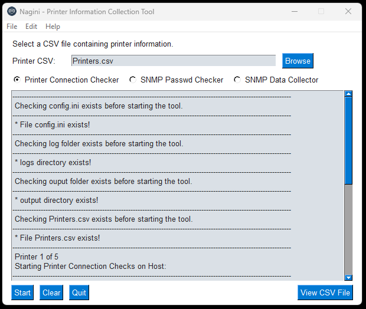

# HP & Xerox Printer Connection Tester & Data Collector Tool.
 - This GUI tool was designed to test HP & Xerox Printer Connectivity, and to collect HP/Xerox printer MI information for MPS discovery purposes.

## Table of Contents
* [General Info](#general-information)
* [Technologies Used](#technologies-used)
* [Features](#features)
* [Setup](#setup)
* [Usage](#usage)
* [Contact](#contact)

## General Information
- This project was developed for the requirements of a large customer in the UK&I.
- The purpose of this project is to enable the HP UK&I MPS team to perform discovery on HP& Xerox Devices on the customer printer estate.
- Due to the technical challenges around device configurations, a tool was required to enable the team to feed in 30,000 IP's, and 1500+ SNMP Community strings from a CSV file based on a location identifier. 
- The customer has 30,000 devices with 1500+ SNMP Get community Passwords - one per location. A large part of the fleet was Xerox, These two issues mean that HP WJA is unable to be used for collecting device information, as it cannot deal with this many SNMP Community Strings and Cannot read Xerox MIBs. 
- Due to time constraints and security considerations, introducing another third party solution was not viable. Also such a solution to meet the SNMP need does not exist. This tool was developed to over come the project issues and allow for delivery of services in a timely manner.
- Some printers had ICMP turned off. All printers allowed HTTP(s) Connections. Printers hostname was unique - DNS FQDN naming convention partly used the printer vendor name. This could be used to identify printer type during discovery.
- This tool tests printer connectivity via ICMP, HTTP/s and DNS, it also collects device information via SNMP and outputs results to a csv file for analysis.
- Adding another tool was not an option.

## Technologies Used
- Python - version 3.10.4 - https://docs.python.org/3/
    - Modules - https://docs.python.org/3/tutorial/modules.html
        - csv - https://docs.python.org/3/library/csv.html#module-csv
        - os - https://docs.python.org/3/library/os.html#module-os
        - os.path - https://docs.python.org/3/library/os.path.html
        - datetime - https://docs.python.org/3/library/datetime.html
        - pysnmp - https://pypi.org/project/pysnmp/
        - sys -  https://docs.python.org/3/library/sys.html
        - re - https://docs.python.org/3/library/re.html#module-re
- Pyinstaller - version 4.10 - https://pyinstaller.readthedocs.io/en/stable/ (Only used to create EXE from *.py files)

## Features
The tool provides the following capabilities:

* Printer Connection Checker. (Is there a printer on the IP? What Type?)
  - Ingest Printer information from CSV (Location ID, Printer IP, Vendor Default SNMP Community String). 
  - Test Printer Connectivity via ICMP Ping.
  - Test Printer Connectivity via HTTP(s) Request. (Some Devices had ICMP Disabled but HTTP enabled).
  - HTTP check will do a web scrape and look for HP/Xerox identifiers to see what type of vendor the web service is running on. 
  - Resolve Printer DNS to FQDN. (Customer used naming conventions for each printer vendor to allow for identification via CSV analaysis). 
  - Output of results / information to csv format.
  - Output of logging for all functions to txt file.

* SNMP Password Checker / Brute Forcer. (What Password matches what location/printer?)
  - Ingest SNMP Community passwords from csv (Location ID, SNMP Community String for Site).
  - Ingest Printer information from csv (Location ID, Printer IP, Vendor Default SNMP Community String). 
  - This function will try to match the printer csv Location ID, to the passwords csv Location ID. 
  - If there is a location match between printers and passwords, matched SNMP Community string ID will be used.
  - If no match then it defaults to the printers default SNMP password in printers csv.
  - The function will use either the location matched SNMP password, or the vendor default SNMP password to try and extract the printer serial number with said password.
  - If the SNMP Password used doesn't work, the serial value in output csv will be blank. 
  - Output of results / information to csv format.
  - Output of logging for all functions to txt file.

* SNMP Printer Data Collector (IPs and SNMP Passwords from previous two features can be fed into this DCA!)
  - Ingest Printer information from CSV (Location ID, Printer IP, SNMP Community String).
  - The tool is designed to collect the following SNMP OID data;
    - Site Code (Trigram)
    - Device Description (Model)
    - IP Address
    - MAC Address
    - Hostname
    - Location
    - Mono Counts
    - Color Counts
    - Total Counts
    - Serial
    - SNMPGET Community String
    - System Information (Firmware Versions)
  - Output of results / information to csv format.
  - Output of logging for all functions to txt file.

* CSV File Viewer
  - Feature allows to select a CSV and then presents the information in a GUI Table. 
  - Designed to be used if tool is being executed from a server with no excel for example.
  - Easier to view thousands of entries when not on a desktop. 
 
## Screenshots

## Setup
The project dependencies as are follows;

- Python - version 3.10.4 - https://docs.python.org/3/
    - Modules - https://docs.python.org/3/tutorial/modules.html
        - csv - https://docs.python.org/3/library/csv.html#module-csv
        - os - https://docs.python.org/3/library/os.html#module-os
        - os.path - https://docs.python.org/3/library/os.path.html
        - datetime - https://docs.python.org/3/library/datetime.html
        - pysnmp - https://pypi.org/project/pysnmp/
        - sys -  https://docs.python.org/3/library/sys.html
        - re - https://docs.python.org/3/library/re.html#module-re

* Setup the project from source files;

    - Download and install Python 3.10.4 from https://www.python.org/downloads/

    - Ensure Python is added to environment SYS Path.

    - Clone this repo to local file system.

    - Install deps from the provided requirements.txt file as per below;
 
        - pip3 install -r requirements.txt

## Usage
* Running the project from source files;

    - Ensure all Dependencies are installed.
    - Populate the CSV file(s) as per the example entry provided. 
    - Run 'python nagini.py' 
    - Check Output dir for output results and logs dir for error logs. 

* Running the project from EXE;

    - Populate the CSV file(s) as per the example entry provided. 
    - Run the EXE file 'Nagini.exe' 
    - Check Output dir for output results and logs dir for error logs.

## Notes

   - All of the code is tested and the tool works.
   - Some of the code still needs refactoring into a decent state, i was in a rush! :o)
   - Some of the information on this README was to accomodate Code / Security Reviews, so if you think TMI that is why ;o)
   - I'm not responsible for how this tool is used. 
    
## Contact
Created by James Dunne, Technology Consultant - HP UK&I - James.Dunne@hp.com
